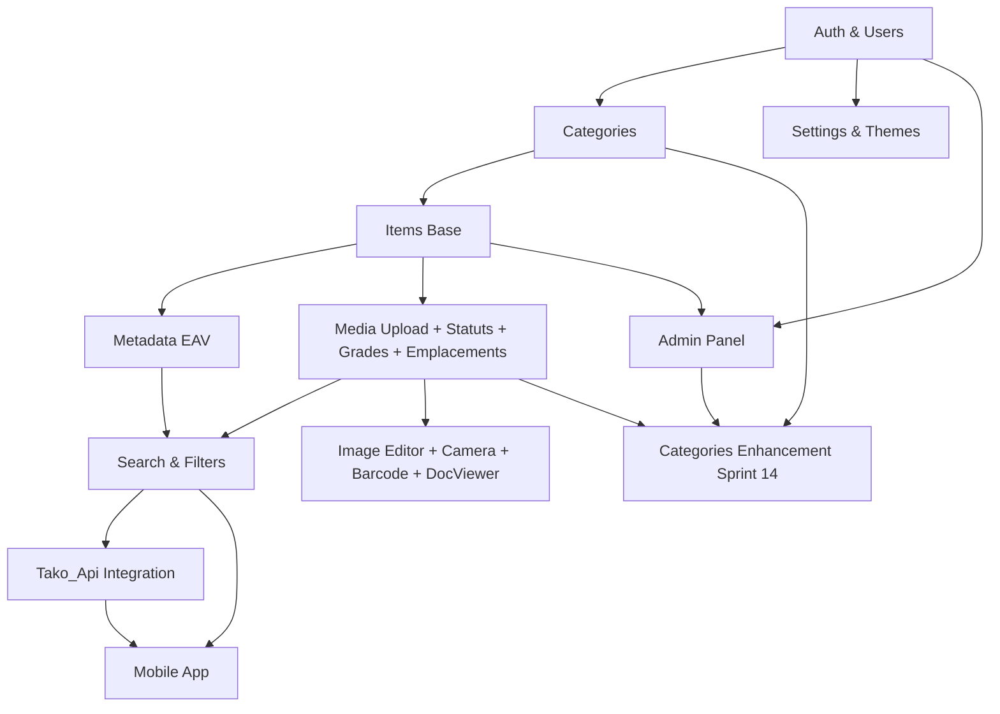

# 🗺️ ROADMAP FONCTIONNALITÉS - SnowShelf v2

> **Plan de développement phasé** - Succession logique des features
> 
> **Date de création** : 20 février 2026  
> **Dernière mise à jour** : 20 mars 2026  
> **Durée estimée totale** : ~20 semaines (5 mois)  
**Status** : ✅ Sprint 0-21 terminés

---

## 🎯 Méthodologie

### Approche
✅ **MVP First** : Fonctionnalités essentielles d'abord  
✅ **Itérations courtes** : Cycles de 2 semaines  
✅ **Releases fréquentes** : Déploiement continu  
✅ **Feedback utilisateurs** : Tests beta à chaque phase  

### Critères de Priorisation
1. **Valeur utilisateur** : Impact sur l'expérience
2. **Complexité technique** : Effort de développement
3. **Dépendances** : Pré-requis fonctionnels
4. **Risques** : Incertitudes techniques

---

## 📅 Timeline Globale

```
┌─────────────────────────────────────────────────────────────────────┐
│                    ROADMAP SNOWSHELF V2                             │
└─────────────────────────────────────────────────────────────────────┘

Phase 0: SETUP (2 sem)              ████
Phase 1: FOUNDATION (4 sem)         ████████
Phase 2: CORE FEATURES (6 sem)      ████████████
Phase 3: ADVANCED (4 sem)           ████████
Phase 4: PRODUCTION (2 sem)         ████
Phase 5: ENHANCEMENT (2 sem)        ████
                                    
Total: 20 semaines

Sprint Planning:
├─ Sprint 0: Dev env setup ✅
├─ Sprint 1-2: Auth & Users ✅
├─ Sprint 3-4: Categories & Items ✅
├─ Sprint 5: Media, Statuts, Grades, Emplacements ✅
├─ Sprint 6: Search & Filters ✅
├─ Sprint 7: Tako_Api Integration ✅
├─ Sprint 8: Image Editor, Camera ✅
├─ Sprint 9-10: PWA Mobile (install, offline, push, native APIs) ✅
├─ Sprint 11: Admin Panel & Analytics ✅
├─ Sprint 12: Production Hardening ✅
├─ Sprint 13: UX/UI Polish & Accessibility ✅
├─ Sprint 14: Categories Enhancement ✅
├─ Sprint 15: Web Search & Import Enhancement ✅
├─ Sprint 16: Admin Field Management & EAV System ✅
└─ Sprint 17: UI Overhaul, Platforms & Tako Import Fixes ✅
└─ Post-Sprint 17: Adaptation Tako v2.0.1 & Import Multi-Média ✅
└─ Sprint 18: Liaison Catégories ↔ Types d'objets & Providers ✅
└─ Sprint 19: Champs personnalisés par catégorie 📐 (en conception)
└─ Sprint 20: Scan barcode / OCR / Image search ✅
└─ Sprint 21: Système d’amis & Collections publiques ✅
```

---

## 🚀 Phase 0: SETUP & INFRASTRUCTURE (2 semaines)

**Objectif** : Préparer l'environnement de développement et l'infrastructure de base

### Sprint 0 (Semaine 1-2)

#### Backend Setup
- [x] Initialiser projet NestJS
- [x] Configurer TypeORM + MariaDB
- [x] Setup Redis
- [x] Configurer environnements (.env)
- [x] Mettre en place structure modulaire
- [x] Setup logging (Winston)
- [x] Configurer validation globale
- [x] Setup Swagger/OpenAPI

#### Frontend Web Setup
- [x] Initialiser projet React + Vite
- [x] Configurer TypeScript strict
- [x] Setup Tailwind CSS
- [x] Configurer i18next
- [x] Setup routing (React Router)
- [x] Configurer state management (Zustand)
- [x] Setup API client (Axios)

#### DevOps Setup
- [x] Créer Docker Compose (dev)
- [x] Setup Git workflow (branches, hooks)
- [x] Configurer ESLint + Prettier
- [x] Setup pré-commit hooks (Husky)
- [x] Créer CI/CD pipeline (GitHub Actions)

#### Documentation
- [x] README.md (installation, usage)
- [x] CONTRIBUTING.md
- [x] Architecture Decision Records (ADR)

**Livrables** :
- ✅ Environnement dev fonctionnel
- ✅ CI/CD opérationnel
- ✅ Documentation de base

---

## 🔐 Phase 1: FOUNDATION (4 semaines)

**Objectif** : Authentification, utilisateurs et structure de base

### Sprint 1 (Semaine 3-4) - Authentication ✅ TERMINÉ (21/02/2026)

#### Backend
- [x] Module Auth
  - [x] Register endpoint + validation
  - [x] Login endpoint + JWT (access 15min + refresh 7d)
  - [x] Refresh token system (rotation automatique)
  - [x] Email verification endpoint
  - [x] Password reset flow
  - [x] Resend verification email endpoint
- [x] Module Users
  - [x] CRUD utilisateurs (GET/PUT /users/me)
  - [x] Profil utilisateur
  - [x] Gestion rôles (free/premium/admin)
- [x] Module Mail (nodemailer)
  - [x] Email de vérification (template HTML stylé)
  - [x] Email de réinitialisation mot de passe
  - [x] SMTP configurable (.env : SMTP_HOST, PORT, USER, PASSWORD, FROM, SECURE)
  - [x] MailHog en dev, SMTP réel en prod
- [x] Admin Seed
  - [x] Création admin au démarrage via ADMIN_EMAIL/USERNAME/PASSWORD
  - [x] Promotion automatique si compte existant
- [x] Security
  - [x] Guards JWT (JwtAuthGuard global + RolesGuard)
  - [x] Rate limiting (ThrottlerModule 100req/60s)
  - [x] Password hashing (bcryptjs, 12 rounds)
  - [x] CORS configuration

#### Frontend
- [x] Pages Auth
  - [x] Page inscription (RegisterPage)
  - [x] Page connexion (LoginPage)
  - [x] Page mot de passe oublié (ForgotPasswordPage)
  - [x] Page vérification email (VerifyEmailPage)
- [x] Auth Flow
  - [x] Store Zustand auth (authStore.ts)
  - [x] Protected routes (ProtectedRoute component)
  - [x] Token refresh automatique (intercepteur Axios)
  - [x] Interceptors Axios (api.ts)

**Tests** :
- [x] Tests manuels register/login/profile (curl) — OK
- [ ] Tests unitaires auth service
- [ ] Tests E2E registration flow
- [ ] Tests E2E login flow

**Livrables** :
- ✅ Système d'authentification complet
- ✅ Gestion des utilisateurs
- ⏳ Tests automatisés à écrire

### Sprint 2 (Semaine 5-6) - User Experience ✅ TERMINÉ (22/02/2026)

#### Backend
- [x] Module Settings (intégré dans UsersModule)
  - [x] Préférences utilisateur (PUT /users/me — theme, lang, newsletter, bio, visibility, showEmail)
  - [x] Thèmes (support 43 thèmes, colonne `theme` dans User entity)
  - [x] Langue (FR/EN, colonne `lang` dans User entity)
  - [x] Upload avatar (POST /users/me/avatar, multer, 2MB max, validation image)
  - [x] Changement mot de passe (PUT /users/me/password)
- [x] Module Notifications
  - [x] Système de notifications in-app (NotificationsModule)
  - [x] Entity Notification (types: welcome, item_added, premium_expiring, system, info)
  - [x] CRUD notifications (GET, PUT read, PUT read-all, DELETE)
  - [x] Notification de bienvenue automatique à l'inscription
  - [x] Templates emails HTML (vérification + reset password)
  - [ ] Queue d'envoi Bull + Redis (à faire)

#### Frontend
- [x] Dashboard utilisateur
  - [x] Page profil (ProfilePage — avatar upload, stats, badges rôle)
  - [x] Page paramètres (SettingsPage — 4 onglets: Apparence, Confidentialité, Notifications, Sécurité)
  - [x] Sélecteur de thème (grille 43 thèmes avec preview couleurs, par groupes)
  - [x] Sélecteur de langue (FR/EN avec persistance)
  - [x] Page notifications (NotificationsPage — liste, marquer lu, supprimer)
- [x] Composants UI de base
  - [x] Design system (13 composants: Button, Input, Card, Modal, Avatar, Badge, Spinner, Switch, Select, Tabs, EmptyState, Skeleton, LoadingPage)
  - [x] Composant notifications/toasts (react-hot-toast)
  - [x] Loading states (Spinner, LoadingPage, Skeleton)
  - [x] Error boundaries (ErrorBoundary)
- [x] Layout & Navigation
  - [x] Header avec avatar, menu dropdown, cloche notifications avec badge
  - [x] Footer "Made with ❤️ by Nimai"
  - [x] Landing page (non connecté) / Dashboard (connecté)
- [x] Système i18n
  - [x] i18next + react-i18next + language detector
  - [x] 3 namespaces (common, auth, settings)
  - [x] Traductions FR + EN complètes
- [x] Système de thèmes
  - [x] 43 thèmes (Core, Popular, Stylish, Catppuccin, Blackberry, Infinity Stones, Rosé Pine, SnowShelf)
  - [x] CSS custom properties, persistance localStorage
  - [x] Application dynamique sans rechargement

**Tests** :
- [x] Tests manuels UI (compilation OK, HMR OK)
- [ ] Tests composants UI
- [ ] Tests d'accessibilité (a11y)

**Livrables** :
- ✅ Profil utilisateur éditable
- ✅ Système de thèmes fonctionnel (43 thèmes)
- ✅ i18n opérationnel (FR/EN)
- ✅ Design system complet (13 composants)
- ✅ Notifications in-app

---

## 📦 Phase 2: CORE FEATURES (6 semaines)

**Objectif** : Gestion des collections (catégories, items, métadonnées)

### Sprint 3 (Semaine 7-8) - Categories ✅ TERMINÉ (22/02/2026)

#### Backend
- [x] Module Categories
  - [x] CRUD catégories (5 endpoints : POST, GET all, GET one, PUT, DELETE)
  - [x] Hiérarchie parent/enfant (ManyToMany self-reference, JoinTable category_relationships)
  - [x] Slug automatique (slugify)
  - [x] Soft delete (@DeleteDateColumn)
  - [x] API endpoints complets avec filtres (all/default/public/mine), search, pagination
  - [x] Contrôle d'accès (propriétaire ou admin pour modification/suppression)
  - [x] DTOs : CreateCategoryDto, UpdateCategoryDto, QueryCategoriesDto
- [x] Module PrimaryTypes
  - [x] Gestion des 11 types de base (books, video_games, music, movies, series, toys_fig, toys_construct, board_games, trading_cards, sticker_albums, divers)
  - [x] 3 endpoints GET (findAll, findOne, getFieldsByKey) avec support i18n (?lang=fr/en)
  - [x] ~90 champs de métadonnées (PrimaryTypeFields) — 11 types de champs (text, textarea, number, year, date, select, multiselect, url, rating, duration, boolean)
  - [x] PrimaryTypeSeedService : création automatique au démarrage (OnModuleInit)

#### Frontend
- [x] Pages Categories
  - [x] CategoriesPage : grille, filtres (toutes/mes/défaut/publiques), recherche avec debounce, suppression avec modal confirmation
  - [x] CategoryFormPage : création/édition, sélecteur d'icône (36 emojis), sélecteur couleur (16 presets + custom), aperçu live, visibilité
  - [x] CategoryDetailPage : détails, statistiques, hiérarchie (parents/enfants), placeholder items Sprint 4
- [x] Services & Types
  - [x] category.service.ts : 5 endpoints catégories + 3 endpoints primary-types
  - [x] category.types.ts : Category, PrimaryType, PrimaryTypeField, DTOs, Response types
- [x] Navigation
  - [x] Lien Header "Catégories" avec icône FolderOpen
  - [x] Dashboard quick actions mis à jour ("Mes catégories" + "Créer une catégorie")
  - [x] 4 routes protégées : /categories, /categories/new, /categories/:id, /categories/:id/edit
- [x] i18n
  - [x] Namespace 'categories' (FR + EN) : titres, filtres, formulaire, détails, erreurs

**Tests** :
- [x] Tests manuels API via curl (GET /primary-types, POST/GET /categories) — OK
- [ ] Tests unitaires catégories service
- [ ] Tests E2E CRUD catégories

**Livrables** :
- ✅ Gestion complète des catégories (CRUD + hiérarchie + filtres)
- ✅ 11 PrimaryTypes avec ~90 champs de métadonnées
- ✅ Interface intuitive (3 pages frontend)
- ✅ i18n FR/EN complet

### Sprint 4 (Semaine 9-10) - Items (Base) ✅ TERMINÉ (22/02/2026)

#### Backend
- [x] Module Items
  - [x] CRUD items (5 endpoints REST)
  - [x] Association catégories (ManyToMany via item_categories)
  - [x] Champs complets (nom, slug, description, notes, prix, rating, barcode, searchState)
  - [x] Soft delete (DeleteDateColumn)
  - [x] Pagination + tri + filtres avancés
  - [x] Agrégations (totalValue, avgRating)
- [x] Module Metadata (EAV)
  - [x] Gestion PrimaryTypeFields (liaison item → champs dynamiques)
  - [x] CRUD metadata dynamiques (save/update/serialize)
  - [x] Validation types de champs (text, number, date, boolean, select, multiselect, url, rating, year, duration)
  - [x] Colonnes typées (valueText, valueNumber, valueDate, valueJson)

#### Frontend
- [x] Pages Items
  - [x] ItemsPage : liste items (grille + liste), recherche debounced, filtres URL, stats bar
  - [x] ItemFormPage : création/édition, sélecteur PrimaryType, catégories chips, rating étoiles, métadonnées dynamiques
  - [x] ItemDetailPage : vue détaillée, sidebar prix/dates, métadonnées formatées, modal suppression
- [x] Composants
  - [x] Formulaire dynamique métadonnées (champs générés selon PrimaryType)
  - [x] Carte item (ItemCard avec type, catégories, valeur, rating, badge searchState)
  - [x] Filtres avancés (catégorie, tri, ordre, searchState)
- [x] Navigation : lien Collection dans Header, quick actions HomePage
- [x] i18n FR/EN complet (namespace items)

**Tests** :
- [x] Tests CRUD items (API curl : create, list, detail, update, delete)
- [x] Tests EAV metadata (métadonnées typées correctement sérialisées)

**Livrables** :
- ✅ Gestion items fonctionnelle (CRUD complet + filtres + pagination)
- ✅ Métadonnées dynamiques EAV (11 types de champs supportés)
- ✅ Interface responsive (grille/liste, formulaire intelligent)
- ✅ Agrégations (valeur totale collection, moyenne ratings)

### Sprint 5 (Semaine 11-12) - Media, Statuts, Grades & Emplacements ✅ TERMINÉ (22/02/2026)

#### Backend
- [x] Module Statuses
  - [x] Entity Status (name, description, color, icon, ordre, user_id, defaut)
  - [x] CRUD endpoints (GET all, POST, PUT, DELETE)
  - [x] Statuts par défaut (seed) : Possédé, Recherché, En transit, Prêté, Vendu, Wishlist
  - [x] StatusSeedService (OnModuleInit)
- [x] Module Grades
  - [x] Entity Grade (name, description, user_id, defaut)
  - [x] CRUD endpoints (GET all, POST, PUT, DELETE)
  - [x] Grades par défaut (seed) : Comme neuf, Très bon état, Bon état, Complet, Incomplet, etc.
  - [x] GradeSeedService (OnModuleInit)
  - [x] ManyToMany item ↔ grades (item_grades)
- [x] Module StorageLocations
  - [x] Entity StorageLocation (name, description, user_id)
  - [x] CRUD endpoints avec items_count
  - [x] FK storage_location_id dans items (ON DELETE SET NULL)
- [x] Module ItemMedia
  - [x] 4 entities médias items : ItemImage, ItemVideo, ItemAudio, ItemDocument
  - [x] Endpoints par type : GET/POST/PUT/DELETE /items/:id/media/:mediaType
  - [x] Endpoint reorder : PUT /items/:id/media/:mediaType/reorder
  - [x] Upload multer multi-fichiers (multipart/form-data)
  - [x] Validation extensions et taille par catégorie
  - [x] Nommage sécurisé UUID
  - [x] Stockage : /storage/users/{userId}/items/{itemId}/{mediaType}/
  - [ ] Upload temporaire (mode création) + finalisation
  - [ ] Génération thumbnails (Sharp, tailles: 150/200/400/800px)
  - [ ] Thumbnails vidéo (ffmpeg)
  - [ ] Cache thumbnails (/storage/thumbnails/)
- [x] Module CategoryMedia
  - [x] 4 entities : CategoryImage, CategoryVideo, CategoryAudio, CategoryDocument
  - [x] Mêmes endpoints que ItemMedia adaptés aux catégories
- [x] Module FileServing (storage controller)
  - [x] Serveur de fichiers statiques avec auth
  - [x] Headers de cache : ETag + Last-Modified
  - [ ] Range requests pour streaming vidéo/audio
  - [ ] Mode streaming pour fichiers >50MB
- [x] Module UploadConfig
  - [x] Configuration centralisée des limites upload

#### Frontend
- [x] Services (status.service.ts, grade.service.ts, storage-location.service.ts, media.service.ts)
- [x] Pages de gestion (StatusesPage, GradesPage, StorageLocationsPage)
- [x] Menu Gestion dans Header (dropdown avec 3 liens)
- [x] Système d'onglets Item (3 onglets) :
  - [x] **Général** (📋) : Champs principaux + statut + grades + emplacement
  - [x] **Détails** (📝) : Métadonnées dynamiques par PrimaryType
  - [x] **Médias** (🖼️) : MediaListManager avec 4 sous-onglets
- [x] Composant MediaListManager (réutilisable items + catégories)
  - [x] Upload drag & drop + sélection fichier
  - [x] Preview images (thumbnail)
  - [x] Réordonnancement par glisser-déposer
  - [x] Suppression individuelle avec modal confirmation
  - [x] Édition titre inline
  - [x] Prévisualisation modal
  - [x] Chargement API au montage + changement d'onglet
  - [ ] Lazy loading IntersectionObserver
  - [ ] Lecteur audio intégré
  - [ ] Suppression globale ("Tout supprimer")
  - [ ] Système fichiers en attente (mode création)
- [x] Vue item détaillée (ItemDetailPage)
  - [x] Badge statut coloré
  - [x] Chips grades
  - [x] Emplacement de stockage avec icône
- [x] i18n : namespace manage (statuts, grades, emplacements, médias) FR + EN
- [x] Stockage bind mount ./storage (contrôle visuel, montage CIFS en prod)

**Tests** :
- [x] Tests API curl (statuses, grades, storage-locations CRUD, media upload, file serving) — OK
- [ ] Tests upload fichiers (validation MIME, taille, extensions)
- [ ] Tests réordonnancement médias

**Livrables** :
- ✅ Upload multi-formats (4 types médias)
- ✅ MediaListManager fonctionnel (items + catégories)
- ✅ Statuts de possession avec seeds système
- ✅ Grades avec seeds système
- ✅ Emplacements physiques de stockage
- ✅ Système 3 onglets dans le formulaire item
- ✅ Pages de gestion (Statuts, Grades, Emplacements) dans menu Gestion
- ⏳ Thumbnails, lecteur audio, upload temporaire à compléter

### Sprint 6 (Semaine 13-14) - Search & Filters ✅ TERMINÉ (23/02/2026)

#### Backend
- [x] Module Search
  - [x] Full-text search (MariaDB FULLTEXT INDEX, MATCH AGAINST IN BOOLEAN MODE + fallback LIKE)
  - [x] Filtres avancés (primaryTypeId, storageLocationId, barcode, gradeIds, statusId, minRating, minValue, maxValue, dateFrom, dateTo)
  - [x] Tri multi-critères (name, createdAt, value, rating, purchasePrice, dateObtained)
  - [x] Search history (Redis, max 20 entrées, TTL 30 jours)
- [x] Optimisation
  - [x] Index FULLTEXT ft_items_search auto-provisionné (OnModuleInit)
  - [x] Cache Redis global (@nestjs/cache-manager + cache-manager-redis-store)
  - [x] Cache résultats recherche (2 min) + suggestions (30 sec)
- [x] Module Search global
  - [x] GET /search — recherche globale (items + catégories)
  - [x] GET /search/suggestions — autocomplete (items, catégories, historique)
  - [x] GET /search/history — historique utilisateur (Redis)
  - [x] DELETE /search/history — effacer tout l'historique
  - [x] DELETE /search/history/entry?q= — supprimer une entrée

#### Frontend
- [x] Composants Search
  - [x] GlobalSearchBar dans Header (autocomplete dropdown, suggestions, historique, navigation)
  - [x] Filtres avancés ItemsPage (catégorie, type, statut, tri, emplacement, note min, valeur, dates)
  - [x] Tri dynamique (6 critères + ordre asc/desc)
  - [x] Suggestions autocomplete (items, catégories, historique avec suppression unitaire)
- [x] Pages
  - [x] SearchResultsPage (/search?q=) — onglets Tout/Objets/Catégories, pagination
  - [x] Historique recherches (intégré dans GlobalSearchBar + endpoint API)
  - [x] Filtre avancé extensible ("Plus de filtres" avec emplacement, note, valeur, dates)
- [x] i18n FR/EN (clés search dans common, filtres avancés dans items)

**Tests** :
- [x] Tests full-text search (curl API — MATCH AGAINST + LIKE fallback) — OK
- [x] Tests filtres combinés (primaryTypeId, statusId, sort, order) — OK
- [x] Tests suggestions autocomplete + historique Redis — OK

**Livrables** :
- ✅ Recherche FULLTEXT performante avec fallback
- ✅ Filtres avancés (10+ critères)
- ✅ Barre de recherche globale avec autocomplete
- ✅ Page résultats de recherche complète
- ✅ Historique de recherche Redis
- ✅ UX recherche fluide

---

## 🎨 Phase 3: ADVANCED FEATURES (4 semaines)

**Objectif** : Fonctionnalités avancées et mobile

### Sprint 7 (Semaine 15-16) - Tako_Api Integration ✅ TERMINÉ

#### Backend ✅
- [x] Module Tako_Api Client (TakoModule)
  - [x] Service HTTP client vers Tako_Api (http://snowshelf_tako_api:3000 via Docker network)
  - [x] Support 11 domaines (construction-toys, videogames, books, comics, anime-manga, media, boardgames, collectibles, tcg, music, ecommerce)
  - [x] Gestion 32 providers via domaines unifiés
  - [x] Cache résultats Redis (TTL configurable, default 3600s)
  - [x] Normalisation Tako_Api response → format unifié TakoSearchResult
  - [x] Retry logic (configurable, default 3 retries) et timeout (AbortSignal.timeout)
  - [x] Health check périodique (5min) avec mise à jour DB
  - [x] Extraction metadata rich par domaine (books: authors/isbn/pageCount, videogames: platforms/genres/metacritic, etc.)
  - [x] `DETAIL_SEGMENTS` mapping (12 domaines × ~30 providers → segment URL de détail) ✔️ Sprint 17
  - [x] Slug-first `sourceId` dans `normalizeOneItem()` (RAWG et providers à slug) ✔️ Sprint 17
  - [x] `autoTrad=true&lang=fr` sur recherche ET détail (sauf JVC déjà FR) ✔️ Sprint 17
- [x] Configuration
  - [x] Entité TakoApiConfig (api_url, timeout, cache_ttl, max_retries, is_active, health_status)
  - [x] Entité Domain (11 domaines seedés)
  - [x] Entité TakoApiDomainMapping
- [x] Controller endpoints
  - [x] POST /search/web → recherche multi-providers avec normalisation
  - [x] GET /search/web/domains → liste domaines et providers disponibles
  - [x] GET /search/web/detail/:domain/:provider/:sourceId → détail d'un item
  - [x] GET /search/web/health → health check Tako_Api
  - [x] POST /search/web/proxy-download → proxy download images externes

#### Frontend ✅
- [x] TakoSearchModal (~700 lignes)
  - [x] Sélecteur de domaine (11 domaines avec icônes emoji)
  - [x] Sélecteur providers optionnel (multi-select avec checkmarks)
  - [x] Recherche texte avec debounce
  - [x] Affichage résultats normalisés (cards expandables)
  - [x] Import données vers item avec proxy download images
  - [x] Appel `getDetail()` avant import pour données complètes (developers, publishers, etc.) ✔️ Sprint 17
- [x] Features
  - [x] Auto-fill métadonnées depuis Tako_Api (mapping per-domain)
  - [x] Import images via proxy download backend
  - [x] Preview données avant import (expand card)
  - [x] Bouton "Recherche web" dans le formulaire item
  - [x] Normalisation objets→strings pour arrays [{name:...}] depuis Tako (developers, publishers, etc.) ✔️ Sprint 17
  - [x] PLATFORM_MAP (~70 aliases) pour mapping automatique plateformes ✔️ Sprint 17
- [x] Service tako.service.ts (search, getDomains, getDetail, proxyDownload, healthCheck, getDomainMapping)
- [x] Types tako.types.ts (TakoDomainName, TakoSearchResult, interfaces)
- [x] i18n FR/EN complet (namespace manage:tako)

**Tests** :
- [x] Test end-to-end API (books, videogames validés)
- [x] Compilation TypeScript sans erreur
- [x] Test import complet avec descriptions FR + developers/publishers ✔️ Sprint 17

**Livrables** :
- ✅ Recherche externe multi-providers (11 domaines, 32 providers)
- ✅ Import automatique métadonnées
- ✅ Proxy download images externes
- ✅ Cache Redis résultats

### Sprint 8 (Semaine 17-18) - Image Editor, Camera ✅ TERMINÉ

> **⚠️ CRITIQUE** : Ces fonctionnalités sont conçues **PWA-first / mobile-first**.
> L'éditeur d'images et la caméra constituent le cœur de l'expérience mobile.
> Toutes les interactions tactiles (pinch-to-zoom, swipe, drag) sont natives.

#### Backend ✅
- [x] Module ImageProcessing (Sharp 0.34.5)
  - [x] Endpoint POST /media/image-temp — stockage temporaire image éditée
    - Réception via FormData (image éditée depuis canvas)
    - Stockage dans /storage/temp/ avec nommage `temp_{userId}_{timestamp}_{random}.{ext}`
    - Nettoyage automatique fichiers > 1h (@Interval 30min)
    - Validation MIME stricte (Sharp metadata)
  - [x] Endpoint POST /media/image-process — crop/resize/rotate/flip/filtres côté serveur
    - Crop avec validation zone min 10px
    - Rotation 90°/180°/270°
    - Flip horizontal/vertical
    - Brightness/contrast/saturation (modulate + linear)
    - Resize avec fit inside + withoutEnlargement
  - [x] Compression optimisée + export multi-formats (JPEG mozjpeg/PNG/WebP)
  - [x] Module enregistré dans AppModule

#### Frontend — ImageEditor ✅ (Canvas 2D natif, AUCUNE lib externe)
- [x] **Transformations**
  - [x] Rotation 90° gauche/droite (0°, 90°, 180°, 270°)
  - [x] Miroir horizontal et vertical (toggles indépendants)
  - [x] Zoom : molette souris + boutons +/-
  - [x] Pan/Déplacement : drag souris
  - [x] Limites zoom : min 0.1x → max 10x
- [x] **Recadrage (Crop)**
  - [x] Zone redimensionnable avec **8 poignées** (4 coins + 4 côtés)
  - [x] Overlay assombri hors zone de crop
  - [x] Grille des tiers (2 lignes H + 2 lignes V)
  - [x] Taille minimum 20px
  - [x] Ratios prédéfinis optionnels (libre, 1:1, 4:3, 3:2, 16:9)
- [x] **Filtres temps réel** (CSS Filters sur canvas)
  - [x] Luminosité (slider -100 à +100)
  - [x] Contraste (slider -100 à +100)
  - [x] Saturation (slider -100 à +100)
- [x] **Export**
  - [x] Formats : JPEG (qualité réglable 10-100%), PNG, WebP
  - [x] Taille max output : 5000px
  - [x] Support `devicePixelRatio` pour écrans haute résolution
- [x] **UX**
  - [x] Bouton Reset (réinitialisation complète)
  - [x] Barre d'outils responsive avec modes (Transformer / Recadrer / Filtres)
  - [x] Plein écran avec fond sombre
  - [x] Ouverture automatique après capture caméra
  - [x] Ouverture depuis bouton « Éditer ✏️ » sur chaque image existante
  - [x] Ouverture automatique avant chaque import d'image (file picker / drag & drop)
    - File d'attente pour imports multiples (une image à la fois)
    - Annuler = skip l'image et passe à la suivante

#### Frontend — CameraCapture ✅ (WebRTC getUserMedia)
- [x] **Flux vidéo**
  - [x] API `navigator.mediaDevices.getUserMedia()` + `enumerateDevices()`
  - [x] Résolution idéale 1920×1080 avec fallback progressif
  - [x] facingMode `environment` (arrière) / `user` (avant)
- [x] **Contrôles caméra**
  - [x] Switch caméra avant/arrière (bouton SwitchCamera)
  - [x] **Sélecteur de caméra** dropdown si >1 caméra détectée (enumerateDevices)
    - Liste avec labels des caméras
    - Switch via `deviceId: { exact: id }`
    - Caméra active mise en surbrillance
  - [x] Flash/Torch : activation hardware via `track.applyConstraints({ advanced: [{ torch: true }] })`
  - [x] Zoom : zoom hardware natif (`capabilities.zoom`) + fallback CSS `transform: scale()`
- [x] **Capture**
  - [x] Bouton capture → canvas snapshot → animation flash blanche
  - [x] Miroir automatique pour caméra frontale
  - [x] Envoi vers ImageEditor après capture (édition immédiate)
- [x] **Fallback**
  - [x] `<input type="file" accept="image/*" capture="environment">` si pas de caméra
  - [x] Écran d'erreur convivial avec bouton de sélection de fichier

#### Frontend — BarcodeScanner (⏳ à faire)
- [ ] Détection via **BarcodeDetector API** native (Chrome/Edge)
- [ ] Fallback **QuaggaJS** (autres navigateurs)
- [ ] Formats supportés : EAN-13, EAN-8, UPC-A, UPC-E, Code 128, Code 39, QR Code, Data Matrix
- [ ] Seuil de confirmation : 2 détections identiques
- [ ] Retour haptique sur mobile

#### Frontend — DocumentViewer (⏳ à faire)
- [ ] **Images** : zoom, rotation, plein écran
- [ ] **PDF** : pdfjs
- [ ] **EPUB** : epubjs
- [ ] **CBZ/CBR** : libarchive.js
- [ ] **ZIP** : jszip

#### Intégration MediaListManager ← ImageEditor/Camera ✅
- [x] Bouton « 📷 Prendre une photo » dans la zone d'upload du MediaListManager (onglet Images)
  - [x] Ouvre CameraCapture → capture → ImageEditor → upload
- [x] Bouton « ✏️ Éditer » sur chaque image existante dans la grille (overlay hover)
  - [x] Ouvre l'image dans ImageEditor → re-upload version éditée (delete + upload)
- [x] **Retouche avant import** : chaque image sélectionnée (file picker / drag & drop) passe par l'ImageEditor
  - [x] File d'attente pour imports multiples
  - [x] Enregistrer → upload + passer à l'image suivante
  - [x] Annuler → skip cette image, passer à la suivante
- [x] i18n FR + EN (namespace manage.media.editor.* + manage.media.camera.*)

**Tests réalisés** :
- [x] Compilation TypeScript backend sans erreur
- [x] Compilation TypeScript frontend sans erreur (0 erreurs sur fichiers media)
- [x] Backend NestJS démarre avec module ImageProcessing chargé
- [x] Upload images opérationnel (file picker + drag & drop)

**Livrables** :
- ✅ Éditeur d'images complet (Canvas 2D natif, 0 dépendance externe)
- ✅ Capture caméra front/back avec zoom, flash et sélection multi-caméras
- ✅ Retouche systématique avant import d'images (avec annulation possible)
- ✅ Backend image processing Sharp (crop, rotate, flip, filtres, multi-format)
- ✅ Intégration complète dans le flux d'upload média
- ⏳ BarcodeScanner et DocumentViewer reportés (sprint suivant)

---

## 📱 Phase 4: PWA & MOBILE (4 semaines)

**Objectif** : Application mobile via **PWA installable** (Progressive Web App) + préparation React Native

> **Stratégie mobile retenue** : PWA d'abord (installable, offline, push), React Native ensuite si nécessaire.
> Le frontend React/Vite est déjà responsive. L'ajout de Service Worker, Web App Manifest et
> APIs natives (caméra, vibration, partage) transforme l'app web en une vraie expérience mobile.

### Sprint 9 (Semaine 19-20) - PWA Foundation

#### PWA Setup
- [x] Web App Manifest (manifest.webmanifest)
  - [x] name, short_name, description, icons (192px, 512px, maskable)
  - [x] start_url, display: standalone, theme_color, background_color
  - [x] screenshots pour l'install prompt
  - [x] categories: ["collections", "lifestyle"]
- [x] Service Worker (Workbox via vite-plugin-pwa)
  - [x] Stratégie cache : NetworkFirst pour API, CacheFirst pour assets
  - [x] Offline fallback page
  - [x] Precache du shell applicatif (HTML, CSS, JS)
  - [x] Cache dynamique des images/médias (StaleWhileRevalidate)
  - [ ] Background sync pour uploads en mode offline
- [x] Install Prompt
  - [x] Interception `beforeinstallprompt`
  - [x] Bannière d'installation personnalisée (non intrusive)
  - [x] Détection si déjà installée (`display-mode: standalone`)
- [x] Push Notifications (Web Push API)
  - [x] VAPID keys (backend)
  - [x] Inscription push dans le frontend
  - [x] Notifications : nouvel item partagé, rappel collection, mise à jour système

#### Adaptations Mobile
- [x] Navigation mobile
  - [x] Bottom tab bar (mobile) vs header nav (desktop)
  - [ ] Gestes swipe pour navigation entre onglets
  - [x] Pull-to-refresh sur les listes
  - [x] Safe area insets (notch, barre de navigation)
- [x] Touch optimizations
  - [x] Touch targets ≥ 44px (WCAG)
  - [x] Haptic feedback (`navigator.vibrate()`) sur actions clés
  - [ ] Long press pour actions contextuelles
  - [ ] Swipe-to-delete sur listes
- [ ] Performance mobile
  - [ ] Lazy loading images (IntersectionObserver)
  - [ ] Virtual scrolling pour grandes listes (react-virtual)
  - [x] Compression images avant upload (côté client, canvas resize)
  - [x] Skeleton screens pendant le chargement

**Livrables** :
- ✅ PWA installable sur mobile (Android + iOS)
- ✅ Mode offline de base (shell + cache)
- ✅ Push notifications
- ✅ UX mobile native-like

### Sprint 10 (Semaine 21-22) - Mobile Features & Offline

#### Offline Mode Avancé
- [ ] IndexedDB pour stockage local des collections
  - [ ] Sync bidirectionnelle (pull/push) avec résolution de conflits
  - [ ] Queue d'opérations offline (création, modification, suppression)
  - [x] Indicateur connexion/hors-ligne dans l'UI
- [x] Cache intelligent des médias
  - [x] Thumbnails en cache (CacheFirst, max 500 items)
  - [ ] Download à la demande des images HD
  - [ ] Gestion quota storage (`navigator.storage.estimate()`)

#### Native-like Features
- [x] Web Share API (`navigator.share()`)
  - [x] Partager un item (titre + description + image + lien)
  - [x] Partager une collection
- [ ] Share Target API (recevoir des partages d'autres apps)
  - [ ] Recevoir une image → ouvrir le formulaire d'ajout
- [x] Badging API (`navigator.setAppBadge()`)
  - [x] Badge sur l'icône app avec nombre de notifications non lues
- [ ] File Handling API (ouvrir des fichiers depuis le système)

#### React Native (Optionnel / Future)
- [ ] Si les limitations PWA bloquent des features critiques :
  - [ ] Expo + React Navigation
  - [ ] Réutilisation services/stores/types du frontend web
  - [ ] expo-camera, expo-image-picker
  - [ ] expo-notifications (push native)
  - [ ] Mode offline avancé (SQLite + sync)

**Tests** :
- [ ] Tests PWA (Lighthouse score > 90)
- [ ] Tests offline (service worker, sync)
- [ ] Tests installation (Android Chrome, iOS Safari)
- [ ] Tests responsive tous breakpoints

**Livrables** :
- ✅ Mode offline complet avec sync
- ✅ Partage natif
- ✅ Expérience mobile indissociable d'une app native

---

## 👑 Phase 5: ADMIN & ANALYTICS (2 semaines)

**Objectif** : Panneau d'administration et analytics

### Sprint 11 (Semaine 23-24) - Admin Panel ✅ TERMINÉ

#### Backend
- [x] Module Admin
  - [x] Dashboard stats
  - [x] Gestion utilisateurs (ban, role change)
  - [ ] Gestion contenus (moderation)
  - [ ] Logs système
  - [ ] Upload config
  - [ ] Tako_Api config (URL, timeout uniquement - pas de gestion clés API)

#### Frontend
- [x] Pages Admin
  - [x] Dashboard analytics
  - [x] Gestion utilisateurs
  - [ ] Modération contenus
  - [ ] Configuration système
  - [ ] Logs de sécurité
- [x] Analytics
  - [x] Graphiques (Recharts)
  - [x] KPIs temps réel
  - [ ] Export rapports

**Livrables** :
- ✅ Panneau admin complet
- ✅ Analytics détaillées

---

## 🔧 Phase 6: PRODUCTION HARDENING (2 semaines)

**Objectif** : Stabilité, performance, sécurité

### Sprint 12 (Semaine 25-26) - Optimization ✅ TERMINÉ

#### Performance
- [x] Code splitting React (React.lazy + Suspense, 20 pages lazy-loaded)
- [x] Lazy loading components (LoadingPage fallback dans Layout)
- [x] Image optimization (WebP thumbnails automatiques via Sharp)
- [x] Database query optimization (reorder transactionnel, I/O async)
- [x] Redis caching strategy (PrimaryTypesService cache 1h TTL)
- [ ] CDN setup (CloudFlare)

#### Security
- [ ] Audit sécurité (OWASP ZAP)
- [ ] Penetration testing
- [x] Content Security Policy (Helmet CSP personnalisé, HSTS, referrer-policy)
- [x] Rate limiting fine-tuning (ThrottlerGuard global 100req/60s)
- [x] Backup automatisé (DB + storage, rotation 10 dernières, gzip)

#### Monitoring
- [ ] Setup Prometheus + Grafana
- [ ] Alerting (PagerDuty)
- [x] Error tracking (GlobalExceptionFilter, logs structurés)
- [x] Performance monitoring (PerformanceInterceptor, slow query logging > 500ms)
- [x] Health check avancé (DB + Redis + mémoire + uptime)

**Tests** :
- [ ] Load testing (k6)
- [ ] Stress testing
- [ ] Security testing

**Livrables** :
- ✅ App optimisée
- ✅ Monitoring complet
- ✅ Security hardening

---

## ✨ Phase 7: POLISH & ENHANCEMENT (2 semaines)

**Objectif** : Expérience utilisateur finale

### Sprint 13 (Semaine 27-28) - UX/UI Polish ✅ TERMINÉ

#### Frontend
- [x] Animations (Framer Motion)
- [x] Micro-interactions
- [x] Loading skeletons
- [x] Empty states
- [x] Error states
- [x] Tooltips & hints
- [x] Onboarding tutorial

#### PWA (déplacé en Phase 4 — Sprint 9)
> La PWA est traitée en Phase 4 car c'est la stratégie mobile principale.
> Voir Sprint 9-10 pour les détails complets.

#### Accessibility
- [x] WCAG 2.1 AA compliance
- [x] Keyboard navigation
- [x] Screen reader support
- [x] Contrast optimization

**Tests** :
- [ ] Tests accessibilité (Axe)
- [ ] Tests cross-browser
- [ ] Tests responsive

**Livrables** :
- ✅ UX polie
- ✅ PWA complète
- ✅ Accessibilité WCAG AA

---

## 📂 Phase 8: CATEGORIES ENHANCEMENT (2 semaines)

**Objectif** : Amener les catégories à parité avec la v1 (médias UI, hiérarchie per-user, copie, admin, seeds) et compléter les fonctionnalités manquantes.

### Sprint 14 (Semaine 29-30) - Categories Enhancement ✅ TERMINÉ

#### Backend
- [x] Hiérarchie par utilisateur
  - [x] Nouvelle table `category_relationships_default` (hiérarchie admin)
  - [x] Ajout `user_id` dans `category_relationships` (hiérarchie per-user)
  - [x] Nouvelle entity `CategoryRelationship` dédiée (remplacement @JoinTable)
  - [x] Nouvelle entity `CategoryRelationshipDefault`
  - [x] Migration TypeORM pour modification de table
  - [ ] Service : copie auto de la hiérarchie par défaut à la première connexion de l'utilisateur
  - [x] Endpoints : GET/PUT hiérarchie personnelle de l'utilisateur
- [x] Copie de catégorie
  - [x] Endpoint POST /categories/:id/copy
  - [x] DTO CreateCategoryCopyDto (name optionnel, copyMedia boolean)
  - [x] Copie : nom, description, notes, icône, couleur, iconType
  - [ ] Copie optionnelle des médias (fichiers dupliqués) — `copyMedia` dans DTO mais pas encore implémenté
  - [x] Champ `originalCreatorId` renseigné
- [x] Admin — gestion catégories par défaut
  - [x] Ajuster permissions : admin peut PUT /categories/:id (si isDefault)
  - [x] Admin peut POST /categories avec `isDefault: true`
  - [ ] Transfert fichiers médias entre `/storage/users/` et `/storage/default_categories/` lors changement `is_default`
- [x] Category-grades association
  - [x] Endpoint PUT /categories/:id/grades (sync grades associés)
  - [x] Grades retournés dans GET /categories/:id (via relation ManyToMany)
- [x] Items dans catégorie
  - [x] Endpoint GET /categories/:id/items (liste paginée des items)
  - [x] Items récents dans réponse GET /categories/:id (5 derniers)
- [x] Seeds catégories par défaut
  - [x] Ajouter 4 nouvelles catégories : Consoles & Systèmes, VHS & LaserDisc, Vinyles, CD Audio
  - [x] Mise à jour CategorySeedService (15 → total)
  - [ ] Seeds `category_relationships_default` pour hiérarchie initiale
  - [ ] Seeds `category_grades` pour associations grades-catégories initiales
- [ ] Intégration médias dans catégories
  - [ ] Relations `@OneToMany` vers les 4 entities médias dans Category entity
  - [ ] Compteurs médias dans GET /categories/:id (images, videos, audio, documents)
  - [ ] Nettoyage fichiers physiques à la suppression de catégorie
  - [ ] Génération thumbnails images (Sharp WebP comme item-media)
  - [ ] Conversion opérations fichier sync → async dans category-media.service
- [ ] Endpoints manquants
  - [ ] POST /categories/import-defaults (import hiérarchie par défaut pour un user)
  - [ ] GET /categories/:id/default-parents (admin)
  - [ ] PUT /categories/:id/default-parents (admin)

#### Frontend
- [ ] Galerie médias dans CategoryDetailPage
  - [ ] Affichage galerie images/vidéos/audio/documents (réutilisation MediaListManager)
  - [ ] Upload médias (drag & drop, file picker, caméra)
  - [ ] Réordonnancement, édition titre, suppression
  - [ ] 4 sous-onglets comme dans ItemFormPage
  - [ ] Compteurs médias dans la page détail
- [x] Sélecteur de parents dans CategoryFormPage
  - [x] Dropdown des catégories existantes (parents potentiels)
  - [ ] Exclusion de la catégorie elle-même et de ses enfants (anti-cycle)
  - [ ] Affichage des parents sélectionnés en chips (actuellement simple select)
- [x] Liste items dans CategoryDetailPage
  - [x] Grille des items récents de la catégorie
  - [ ] Tri, pagination (lien vers /items?category=id)
  - [x] Lien vers liste complète des items
  - [x] Compteur total affiché
- [x] Bouton copie dans CategoryDetailPage
  - [x] Bouton "Copier" affiché
  - [ ] Modal de confirmation (nom personnalisable, option copie médias) — copie directe actuellement
  - [ ] Redirection vers la catégorie copiée après succès
- [x] Admin — édition catégories par défaut
  - [x] Bouton "Modifier" visible pour admin sur catégories par défaut
  - [x] Toggle `isDefault` dans le formulaire (admin uniquement)
  - [x] Bouton admin stylé dans CategoriesPage (admin uniquement)
- [x] Gestion grades par catégorie
  - [x] Section "Grades associés" dans CategoryDetailPage
  - [ ] Multi-select grades avec checkboxes dans CategoryFormPage
  - [x] Sauvegarde via PUT /categories/:id/grades
- [x] i18n
  - [x] Nouvelles clés FR/EN : copie, grades associés, items, admin default, hiérarchie

**Tests** :
- [ ] Tests migration DB (category_relationships + defaults)
- [ ] Tests copie catégorie (avec/sans médias)
- [ ] Tests admin modification catégories par défaut
- [ ] Tests hiérarchie per-user
- [ ] Tests category-grades association

**Livrables** :
- ✅ Hiérarchie catégories par utilisateur (comme v1)
- ✅ Copie de catégorie avec option médias
- ✅ Admin peut modifier/créer catégories par défaut
- ✅ Galerie médias catégories (MediaListManager refactoré item/category)
- ✅ Liste items dans page catégorie
- ✅ Association grades ↔ catégories (backend + affichage)
- ✅ 15 catégories par défaut (4 nouvelles)
- ✅ Endpoints import-defaults, default-parents (GET/PUT)
- ✅ Thumbnails WebP pour images catégories (Sharp)
- ✅ Opérations fichier async dans category-media.service

---

## 🚀 Phase 9: SEARCH & IMPORT ENHANCEMENT

**Objectif** : Corriger les lacunes du système de recherche web et d'import : mapping automatique domaine→type, import d'images, mapping métadonnées vers champs EAV, détection de doublons, et enrichissement des données récupérées.

### Sprint 15 (Semaine 31-32) - Web Search & Import Enhancement ✅ TERMINÉ

#### Problèmes identifiés et corrigés

**Backend (✅ Tous corrigés)** :
- ✅ Constante `DOMAIN_TO_PRIMARY_TYPE` : mapping automatique domaine Tako → PrimaryType (11 mappings)
- ✅ Constante `TAKO_FIELD_MAPPING` : mapping métadonnées Tako → fieldKey EAV pour chaque type
- ✅ `extractMetadata()` enrichi avec 40+ champs supplémentaires (books, videogames, music, media, construction-toys, boardgames, tcg, collectibles)
- ✅ Nouvel endpoint `GET /search/web/domain-mapping` : retourne les mappings domaine→type et field mappings
- ✅ Nouvel endpoint `GET /items/check-duplicate?barcode=xxx&name=yyy` : détection doublons par barcode puis par nom
- ✅ Méthode `checkDuplicate()` dans `items.service.ts`

**Frontend (✅ Tous corrigés)** :
- ✅ `handleTakoImport` réécrit : détection doublons, auto PrimaryType, mapping EAV, image en attente
- ✅ `pendingImageUrl` : stocke l'URL proxy image en attente d'upload après sauvegarde
- ✅ Image attachée automatiquement après création/modification d'item (fetch blob → upload média)
- ✅ Bannière de prévisualisation image en attente dans le formulaire
- ✅ `checkDuplicate()` dans `item.service.ts`, `getDomainMapping()` dans `tako.service.ts`
- ✅ Traductions FR/EN complètes (6 nouvelles clés Tako)

**Correction onglets formulaire item (✅)** :
- ✅ Onglet "Général" : contient TOUS les champs fixes (nom, description, type, catégories, note, état, prix, valeur, date, code-barres, notes, statut, grades, emplacement)
- ✅ Onglet "Détails" : contient UNIQUEMENT les champs dynamiques EAV spécifiques au type (auteur, pages, ISBN pour livres ; développeur, plateforme pour jeux vidéo ; etc.)
- ✅ Onglet "Détails" affiche un message "Sélectionnez un type" quand aucun type n'est sélectionné
- ✅ Onglet "Médias" : inchangé
- ✅ Image importée correctement lors de la modification d'un item existant (pas seulement à la création)
- ✅ Nouvelles clés i18n FR/EN (14 clés : detailsSection, statusSection, status, grades, selectGrades, storageLocation, noLocation, selectTypeFirst, selectTypeFirstDesc, noFieldsForType, typeSpecificFields, typeSpecificFieldsDesc)

---

## �️ Phase 10: ADMIN FIELD MANAGEMENT & EAV SYSTEM

**Objectif** : Compléter le système EAV en ajoutant une interface d'administration CRUD pour les champs détails de chaque type d'objet (PrimaryTypeField), corriger le bug d'affichage des champs dans l'onglet Détails, et synchroniser les `fieldOptions` des champs select/multiselect.

### Sprint 16 (Semaine 33-34) - Admin Field Management ✅ TERMINÉ

#### Analyse et diagnostic

- ✅ Analyse approfondie de l'ancien système (.Back_up) : 3 tables (primary_type_fields, primary_type_key_to_field, field_transform_types), 12+ types de champs, admin PHP complet
- ✅ Analyse du système actuel : entités PrimaryType/PrimaryTypeField/ItemMetadata existent, 90 champs seedés pour 11 types, mais `fieldOptions` toutes NULL
- ✅ **Bug racine identifié** : `getFieldsByKey` retourne `{ data: [array] }` mais le frontend faisait `res.data.fields` → corrigé avec `Array.isArray(res.data)` check

#### Backend (✅ Tous implémentés)

**Service (`primary-types.service.ts`)** :
- ✅ `getFieldsForAdmin(primaryTypeId)` : liste brute complète des champs avec toutes les colonnes
- ✅ `getFieldForAdmin(fieldId)` : détails d'un champ unique
- ✅ `createField(dto)` : création avec auto-calcul sortOrder, validation unicité fieldKey
- ✅ `updateField(fieldId, dto)` : modification partielle, vérifie unicité si fieldKey change
- ✅ `deleteField(fieldId)` : suppression avec invalidation cache
- ✅ `reorderFields(primaryTypeId, fieldOrders)` : réordonnancement
- ✅ `getFieldTypes()` : enum des 11 types de champs avec labels FR
- ✅ `invalidateCache()` : invalidation de tous les caches liés (par id, par keyName, listes)
- ✅ `mapFieldForAdmin()` : helper mapping champ → DTO admin
- ✅ `CreateFieldDto`, `UpdateFieldDto` interfaces exportées
- ✅ `FIELD_TYPE_LABELS` : mapping enum → labels FR (11 types)

**Controller (`primary-types.controller.ts`)** :
- ✅ `GET /field-types` — public, types de champs disponibles (placé AVANT `:id` pour éviter conflit route)
- ✅ `GET /:id/admin-fields` — admin, champs bruts d'un type
- ✅ `GET /fields/:fieldId/admin` — admin, détails d'un champ
- ✅ `POST /fields` — admin, créer un champ
- ✅ `PUT /fields/:fieldId` — admin, modifier un champ
- ✅ `DELETE /fields/:fieldId` — admin, supprimer un champ
- ✅ `PUT /:id/reorder-fields` — admin, réordonner les champs

**Seed (`primary-type-seed.service.ts`)** :
- ✅ Refactoring : données de champs extraites dans `getFieldsSeedData()` (méthode réutilisable)
- ✅ `syncFieldOptions()` : sur restart, met à jour les `fieldOptions` NULL et crée les champs manquants
- ✅ 90 champs avec `fieldOptions` complètes (13 genres livres, 14 genres jeux vidéo, 12 genres musique, etc.)
- ✅ 30 champs synchronisés au redémarrage (options SELECT/MULTISELECT peuplées)

#### Frontend (✅ Tous implémentés)

**Page admin (`AdminFieldsPage.tsx`)** :
- ✅ Sélecteur de type avec boutons icônes (11 types)
- ✅ Table desktop (colonnes : drag handle, icône, clé, nom FR/EN, type, options, requis, actions)
- ✅ Cards mobile avec drag-and-drop
- ✅ Modal création/édition : nom FR/EN, clé auto-générée, type de champ, sélecteur d'icônes, options (textarea une par ligne), placeholders FR/EN, help texts FR/EN, switches (requis/recherchable/filtrable)
- ✅ Suppression avec confirmation
- ✅ Réordonnancement par drag-and-drop + bouton "Sauver l'ordre"
- ✅ Badges colorés par type de champ

**Service (`admin.service.ts`)** :
- ✅ `getPrimaryTypes()` : liste des types
- ✅ `getFieldTypes()` : types de champs disponibles
- ✅ `getFieldsForAdmin(primaryTypeId)` : champs d'un type
- ✅ `createField()`, `updateField()`, `deleteField()`, `reorderFields()`

**Route & navigation** :
- ✅ Route `/admin/fields` dans `App.tsx` avec `ProtectedRoute roles={['admin']}`
- ✅ Lien "Champs par type" dans le dashboard admin
- ✅ Lazy-loading de la page

**Bug fix formulaire item** :
- ✅ `ItemFormPage.tsx` : `Array.isArray(res.data) ? res.data : (res.data?.fields || [])` — corrige le chargement des champs EAV

**i18n** :
- ✅ 30+ clés FR : `fields.title`, `fields.subtitle`, `fields.selectType`, `fields.form.*`, `fields.col.*`, `fields.deleteConfirm`, etc.
- ✅ 30+ clés EN correspondantes

---

## �📊 Fonctionnalités par Priorité

### 🔴 P0 - Critiques (MVP)
- [x] Authentification (register, login, JWT)
- [x] Gestion utilisateurs
- [x] CRUD catégories
- [x] CRUD items
- [x] Métadonnées EAV
- [x] Upload images
- [x] Recherche basique
- [x] API REST complète

### 🟠 P1 - Importantes
- [x] Statuts de possession (CRUD + seeds système) ✔️ Sprint 5
- [x] Grades multi-select ✔️ Sprint 5
- [x] Emplacements de stockage ✔️ Sprint 5
- [x] Upload médias 4 types ✔️ Sprint 5
- [x] Système d'onglets item (Général / Détails / Médias) ✔️ Sprint 5
- [x] Medias de catégories (4 types) ✔️ Sprint 5
- [x] Recherche avancée + filtres ✔️ Sprint 6
- [x] Tako_Api integration (32 providers, 11 domaines, autoTrad FR, getDetail, DETAIL_SEGMENTS) ✔️ Sprint 7 + 17
- [x] Système de thèmes (43 thèmes) ✔️ Sprint 2
- [x] i18n (FR/EN) ✔️ Sprint 2
- [x] PWA installable (Service Worker, manifest, offline, push) ✔️ Sprint 9-10
- [x] Image editor complet (crop, rotate, filtres, export multi-format, Canvas natif) ✔️ Sprint 8
- [x] Camera capture (front/back, zoom, flash, sélection caméra) ✔️ Sprint 8
- [ ] Barcode scanner (BarcodeDetector + QuaggaJS, 8 formats)
- [ ] Galerie médias catégories (UI frontend, upload/reorder/suppression) — Sprint 14
- [x] Hiérarchie catégories par utilisateur (per-user, comme v1) — Sprint 14 ✔️
- [ ] Copie de catégorie (POST /copy, avec/sans médias) — Sprint 14 (copie sans médias OK)
- [x] Admin gestion catégories par défaut (modifier, créer, toggle isDefault) — Sprint 14 ✔️
- [x] Association grades ↔ catégories (UI sélection, endpoints) — Sprint 14 ✔️
- [x] Liste items dans CategoryDetailPage (tableau paginé) — Sprint 14 ✔️
- [x] 15 catégories par défaut (+4 nouvelles : Consoles, VHS, Vinyles, CD Audio) — Sprint 14 ✔️
- [x] Page détail item refaite (hero image, lightbox, galerie médias, layout 3 colonnes) — Sprint 17 ✔️
- [x] 41 plateformes jeux vidéo + page admin dédiée (drag-and-drop) — Sprint 17 ✔️
- [x] Tako import corrigé (getDetail, DETAIL_SEGMENTS, slug-first, autoTrad FR, normalisation objets) — Sprint 17 ✔️
- [x] PLATFORM_MAP (~70 aliases) pour mapping automatique import — Sprint 17 ✔️

### 🟡 P2 - Nice to Have
- [ ] Thumbnails (Sharp + ffmpeg, cache MD5)
- [ ] Streaming vidéo/audio (Range requests)
- [ ] Document viewer (PDF, EPUB, CBZ/CBR, ZIP)
- [ ] Lecteur audio intégré dans MediaListManager
- [ ] Upload temporaire + finalisation (mode création)
- [x] Admin panel ✔️ Sprint 11
- [x] Admin field management (CRUD champs par type) ✔️ Sprint 16
- [x] Admin platforms management (41 plateformes, drag-and-drop, groupes) ✔️ Sprint 17
- [x] Analytics ✔️ Sprint 11
- [x] Page détail item refaite (hero, lightbox, galerie médias) ✔️ Sprint 17
- [x] Import Tako : getDetail, autoTrad FR, DETAIL_SEGMENTS, PLATFORM_MAP ✔️ Sprint 17
- [ ] Mode offline avancé (IndexedDB + sync bidirectionnelle)
- ~~React Native~~ (remplacé par PWA)

### 🟢 P3 - Future
- [ ] Import/Export collections (CSV, JSON)
- [ ] Partage de collections publiques
- [ ] Collaboration multi-utilisateurs
- [ ] API publique pour développeurs
- [ ] Intégrations tierces (Zapier, IFTTT)
- [ ] Machine learning (recommandations)

---

## 🎯 Métriques de Succès

### Phase 1 (Foundation)
- [ ] 100% tests auth passants
- [ ] <200ms temps de réponse API auth
- [ ] 0 vulnérabilités critiques

### Phase 2 (Core Features)
- [ ] CRUD items fonctionnel à 100%
- [ ] Upload média <5s pour 10MB
- [ ] Recherche <100ms sur 10k items

### Phase 3 (Advanced)
- [ ] Tako_Api intégrée (32 providers via 11 domaines)
- [ ] Image editor fonctionnel tous browsers
- [ ] 0 bugs critiques

### Phase 4 (PWA Mobile)
- [ ] PWA installable (Lighthouse > 90)
- [ ] Mode offline fonctionnel avec sync
- [ ] Expérience mobile < 3s premier chargement

### Phase 5 (Production)
- [ ] Uptime >99.9%
- [ ] Load time <2s (LCP)
- [ ] Security score A+

---

## 🚦 Risques & Mitigation

### Risques Techniques

| Risque | Impact | Probabilité | Mitigation |
|--------|--------|-------------|------------|
| Performance recherche sur grosse BDD | 🔴 Élevé | 🟡 Moyen | Index MariaDB + Cache Redis + Pagination |
| Upload fichiers volumineux timeout | 🟠 Moyen | 🟡 Moyen | Chunked upload + Progress feedback |
| APIs externes rate limited | 🟠 Moyen | 🔴 Élevé | Cache 24h + Queue système + Retry logic |
| Scalabilité mobile offline | 🟠 Moyen | 🟡 Moyen | SQLite + Sync incrémentale stratégique |
| Sécurité uploads malveillants | 🔴 Élevé | 🟡 Moyen | Validation MIME + ClamAV + Sandbox |

### Risques Projet

| Risque | Impact | Probabilité | Mitigation |
|--------|--------|-------------|------------|
| Scope creep | 🟠 Moyen | 🔴 Élevé | Roadmap stricte + Priorisation ruthless |
| Estimation temps dépassée | 🟡 Faible | 🟡 Moyen | Buffer 20% + Révisions bi-weekly |
| Dépendances bloquantes | 🟠 Moyen | 🟡 Moyen | Architecture découplée + Mocks |
| Migration données v1→v2 | 🔴 Élevé | 🟡 Moyen | Scripts migration + Tests exhaustifs + Rollback plan |

---

## 📋 Dépendances entre Features



---

## ✅ Conditions de Passage (Definition of Done)

### Feature complète quand :
- [ ] Code écrit et peer reviewed
- [ ] Tests unitaires >80% coverage
- [ ] Tests E2E pour flows critiques
- [ ] Documentation (JSDoc + README)
- [ ] UI responsive (mobile, tablet, desktop)
- [ ] Accessibilité (a11y) validée
- [ ] i18n (FR + EN) complète
- [ ] Performance validée (<2s load)
- [ ] Déployé en staging
- [ ] Testé par QA
- [ ] Validé par Product Owner
- [ ] Logs et monitoring en place

---

## 🎉 Jalons (Milestones)

### M1 - Alpha (Fin Phase 1, S6)
**MVP authentification + utilisateurs**
- Login/Register fonctionnel
- Profil utilisateur
- Tests passants

### M2 - Beta privée (Fin Phase 2, S14)
**Gestion collections complète**
- CRUD catégories/items
- Upload média
- Recherche

### M3 - Beta publique (Fin Phase 3, S18)
**Features avancées**
- Tako_Api integration
- Image editor
- Camera capture

### M4 - RC PWA Mobile (Fin Phase 4, S22)
**PWA installable + mobile-first**
- PWA installable (Android + iOS)
- Mode offline + sync
- Push notifications
- Expérience mobile native-like

### M5 - Production (Fin Phase 6, S26)
**Déploiement production**
- Monitoring complet
- Security hardening
- Performance optimisée

### M6 - v2.0 Release (Fin Phase 7, S28)
**Version finale polie**
- PWA complète
- UX/UI finalisée
- Documentation complète

---

## 🔄 Processus de Release

```
Development
    ↓
Feature branch (feature/xyz)
    ↓
Pull Request → Code Review
    ↓
Merge to develop
    ↓
Auto deploy → Staging
    ↓
QA Testing
    ↓
Merge to main
    ↓
Tag version (v2.x.x)
    ↓
Auto deploy → Production
    ↓
Monitoring 24h
    ↓
Go/No-Go decision
```

---

---

## 🎮 Phase 11: UI OVERHAUL, PLATFORMS & TAKO IMPORT FIXES

**Objectif** : Refonte visuelle des pages de détail d'items, overhaul complet du système de plateformes jeux vidéo, corrections critiques de l'import Tako (détails, traduction FR, normalisation des données).

### Sprint 17 (Semaine 35-36) - UI Overhaul, Platforms & Tako Import Fixes ✅ TERMINÉ (25/02/2026)

#### Refonte page détail d'item (ItemDetailPage) ✅

- [x] **Section Hero** : image principale grande à gauche + infos header à droite (badges type, statut, titre h1, rating étoiles, description tronquée)
- [x] **Lightbox images** : navigation plein écran (overlay sombre), navigation clavier (Escape, flèches), bouton téléchargement, compteur `{n}/{total}`
- [x] **Galerie médias** : section dédiée "Médias" dans Card avec grille responsive (2→3→4 cols)
  - [x] Images : grille cliquable → Lightbox, effet hover scale+zoom, badge `+{n}` photos
  - [x] Vidéos : lecteurs `<video>` avec contrôles natifs
  - [x] Audio : lecteurs `<audio>` avec titre
  - [x] Documents : liens téléchargeables avec taille formatée
- [x] **Layout 3 colonnes** desktop : contenu principal (métadonnées, notes, médias) + sidebar (prix, valeur, dates, catégories, grades, emplacement)
- [x] **Fallback visuel** : emoji PrimaryType en grand si pas d'image
- [x] **Web Share API** : bouton partager un item

#### Thumbnails collection sur cartes ✅

- [x] Backend : serveur de fichiers statiques pour thumbnails catégories
- [x] Frontend : affichage thumbnail sur les cartes de collection (grille + liste)

#### Overhaul système de plateformes jeux vidéo ✅

**Backend** :
- [x] Seed étendu à **41 plateformes** organisées par constructeur dans `PrimaryTypeSeedService`
  - PC (1), Sony (7), Microsoft (4), Nintendo consoles (7), Nintendo portables (5), Sega (5), Classiques (8), Modernes (4)
- [x] `syncFieldOptions()` : mise à jour des options du champ `platform` sans re-seeder

**Frontend** :
- [x] **`PLATFORM_MAP`** dans `ItemFormPage.tsx` : ~70 aliases mappant vers les 41 plateformes normalisées
  - Couvre toutes les variantes : `'ps5'→'PlayStation 5'`, `'genesis'→'Mega Drive'`, `'n64'→'Nintendo 64'`, etc.
  - Chaîne de résolution : match exact → PLATFORM_MAP → LANG_MAP → GENRE_MAP → match partiel
- [x] **`AdminPlatformsPage.tsx`** (323 lignes) : page admin complète de gestion des plateformes
  - Affichage groupé par constructeur (PC, Sony, Microsoft, Nintendo, Sega, Autres)
  - Drag-and-drop pour réordonner les plateformes
  - Ajout/suppression individuelle
  - Détection changements non sauvegardés (badge animé)
  - Sauvegarde via `adminService.updateField()`
- [x] Route `/admin/platforms` avec `ProtectedRoute roles={['admin']}`
- [x] Lien "Plateformes" dans le dashboard admin avec badge navigation
- [x] i18n FR/EN complet (namespace admin: platforms.*)

#### Corrections import Tako API ✅

**Bug 1 : Développeurs/éditeurs non importés** :
- [x] **Diagnostic** : `TakoSearchModal.handleImport` n'appelait pas `getDetail()` — seuls les résultats légers de recherche étaient utilisés (pas de developers/publishers)
- [x] **Fix** : ajout d'un appel `takoService.getDetail()` dans `handleImport` AVANT l'import
  - Merge du résultat détaillé avec le résultat de recherche (imageUrl fallback)
  - Proxy download de l'image depuis le résultat détaillé

**Bug 2 : URL de détail Tako incorrecte** :
- [x] **Diagnostic** : le backend envoyait `/api/videogames/rawg/59184` (ID numérique, pas de segment), alors que Tako attend `/api/videogames/rawg/game/kingdom-hearts` (slug + segment)
- [x] **Fix** : ajout de `DETAIL_SEGMENTS` mapping (~30 providers × 12 domaines) dans `tako.service.ts`
  - Ex: `videogames.rawg → 'game'`, `books.googlebooks → 'volume'`, `media.tmdb → 'movie'`
- [x] **Fix** : priorité `slug` sur `sourceId` numérique dans `normalizeOneItem()` pour RAWG et autres providers à slug

**Bug 3 : Tableaux d'objets non normalisés** :
- [x] **Diagnostic** : Tako retourne `developers: [{name: "Square", ...}]` (objets), mais le frontend attendait des strings
- [x] **Fix** : normalisation dans `handleTakoImport` — détection `Array.isArray` d'objets, extraction `.name || .title || .label`

**Bug 4 : Description en anglais** :
- [x] **Diagnostic** : Tako supporte `?autoTrad=true&lang=fr` pour la traduction automatique des descriptions
- [x] **Fix** : ajout `&autoTrad=true&lang=fr` sur l'URL de recherche ET l'URL de détail
- [x] Exception JVC : pas de `autoTrad` car JVC est déjà en français
- [x] **Bug Tako corrigé** : `genre.toLowerCase is not a function` quand genre est un objet → signalé et corrigé dans Tako, container redémarré

**Résultats vérifiés** (test Kingdom Hearts) :
- ✅ Description en français : "Kingdom Hearts est l'histoire de Sora, un garçon de 14 ans..."
- ✅ Developers : Square
- ✅ Publishers : Sony Computer Entertainment, Square  
- ✅ Platforms : PlayStation 2
- ✅ Genres : Action, RPG

#### Corrections thème UI ✅

- [x] Fix couleurs dropdown/select : remplacement `--color-bg` par `--color-surface` pour cohérence avec tous les thèmes (43 thèmes)

**Tests** :
- [x] Test API détail complet avec autoTrad (curl direct + via backend) — OK
- [x] Test normalisation objets (developers/publishers extraits en strings) — OK
- [x] Test PLATFORM_MAP (70 aliases résolus correctement) — OK
- [x] Test import end-to-end (recherche → détail → données FR + métadonnées complètes) — OK

**Livrables** :
- ✅ Page détail item entièrement refaite (hero, lightbox, galerie médias, layout 3 colonnes)
- ✅ Thumbnails collection visibles sur les cartes
- ✅ 41 plateformes jeux vidéo avec page admin dédiée (drag-and-drop, groupes constructeur)
- ✅ Import Tako corrigé : getDetail avant import, DETAIL_SEGMENTS, slug-first sourceId
- ✅ Import Tako complet : descriptions en français (autoTrad), normalisation objets→strings
- ✅ ~70 aliases PLATFORM_MAP pour mapping automatique

### Post-Sprint 17 — Adaptation Tako v2.0.1 & Import Multi-Média ✅ TERMINÉ (26/02/2026)

#### Adaptation Tako API v2.0.1 ✅

**Contexte** : Tako a été mis à jour en v2.0.1 avec un format de réponse standardisé pour tous les providers. Notre code a été adapté en conséquence.

**Backend (`tako.service.ts`, ~1270 lignes)** :
- [x] `normalizeSingleResult()` : gestion du double-wrapping TMDB v2.0.1 (`data.data` → unwrap automatique)
- [x] `normalizeOneItem()` : support format plat v2.0.1 (`item.images.primary`, `item.urls.source`)
- [x] `extractMetadata()` pour `construction-toys` : nouveaux champs v2.0.1 (`setNumber`, `pieceCount`, `minifigCount`, `ageRange`, `releaseDate`, `retirementDate`, `barcodes`, `sku`)
- [x] Normalisation prix : objet `{ amount, value, currency }` → nombre
- [x] `TAKO_FIELD_MAPPING.toys_construct` : ajout clés v2.0.1 (`setNumber→set_number`, `pieceCount→pieces`, `minifigCount→minifigs`)
- [x] `price` non mappé en EAV (pas de champ EAV `price` pour `toys_construct`) — géré séparément via `marketValue`

**Import multi-média** :
- [x] `extractMedia()` : extraction images gallery, vidéos (YouTube/MP4), documents (instructions PDF)
  - Vidéos : merge `item.videos[]` + `item.details?.videos[]` → array `TakoMediaRef`
  - Instructions : `item.instructions.manuals[]` || `item.details?.instructions.manuals[]` → documents PDF
  - Images : `item.images.gallery[]` || `item.details?.images[]` → extraImages
- [x] DTO `TakoSearchResult` : ajout champs `extraImages`, `videos`, `documents` (type `TakoMediaRef[]`)
- [x] Frontend `TakoSearchModal` : proxy-download multiple médias après import, toast avec compteur
- [x] Frontend `ItemFormPage` : système `pendingMedia` pour rattacher les médias après save
  - Les médias sont stockés temporairement côté serveur et rattachés à l'item après création

**Frontend pré-remplissage prix** :
- [x] `handleTakoImport()` section "2b" : extraction `meta.price` (objet ou nombre) → `marketValue`

**Tests vérifiés** :
- ✅ LEGO 10316 (Fondcombe) : setNumber=10316, pieceCount=6167, minifigCount=15, price=499.99, 36 images, 3 vidéos, 6 documents
- ✅ TMDB 550 (Fight Club) : runtime=139, genres=['Drame','Thriller'], budget=63000000, 8 vidéos
- ✅ RAWG (The Witcher 3) : metacritic=92, developers=['CD PROJEKT RED'], releaseDate=2015-05-18
- ✅ Endpoint `domain-mapping` : toutes les clés v2.0.1 correctement exposées

#### Adaptation Tako v2.0.1 — Tous domaines ✅ (27/02/2026)

**Contexte** : Vérification et correction de TOUS les domaines impactés par Tako v2.0.1, pas seulement construction-toys.

**DETAIL_SEGMENTS (15 corrections)** :
- [x] `books` : suppression segments (`googlebooks:'volume'` → aucun, `openlibrary:'book'` → aucun)
- [x] `music` : pluralisation (`discogs:'release'→'releases'`, `deezer/musicbrainz/itunes:'album'→'albums'`)
- [x] `tcg` : provider renommé (`pokemon-tcg` → `pokemon`)
- [x] `boardgames` : provider renommé (`boardgamegeek` → `bgg`)
- [x] `construction-toys` : segments (`rebrickable/brickset:'set'→'sets'`), suppression segments playmobil/klickypedia/mega
- [x] `anime-manga` : `mangaupdates:'manga'→'series'`
- [x] `videogames` : `consolevariations:'console'→'item'`

**DOMAIN_PROVIDERS** :
- [x] `boardgamegeek` → `bgg`
- [x] `pokemon-tcg` → `pokemon`

**extractMetadata — media (TMDB)** :
- [x] `vote_average` → `rating: { average, votes }` (objet) → extrait `rating.average` en `voteAverage`
- [x] `director` → `directors[]` (array d'objets `{ id, name, profile }`) → extrait `.name` en `director`
- [x] `original_language` → `originalLanguage` (camelCase)
- [x] `production_companies` → `productionCompanies[]` (array d'objets) → extrait `.name`
- [x] `number_of_seasons` → `numberOfSeasons`
- [x] `number_of_episodes` → `numberOfEpisodes`
- [x] `created_by` → `createdBy[]` (array d'objets) → extrait `.name` en `creator`
- [x] `media_type` → `mediaType`

**extractMetadata — music (Discogs)** :
- [x] `tracklist` → `tracks[]` (array de `{ position, title, duration, durationSeconds }`)
- [x] `label` → `labels[]` (array de `{ name, catalogNumber }`) → join noms
- [x] `format` → `formats[]` (array de `{ name, qty, descriptions }`) → join noms
- [x] `nb_tracks`/`tracks_count` → `trackCount` (nombre)
- [x] Nouveau champ `releaseDate`

**extractMetadata — boardgames (BGG)** :
- [x] `minPlayers`/`maxPlayers` → `players: { min, max }` (objet) → extrait `.min`/`.max`
- [x] `playingTime` → `playTime: { min, max, average }` (objet) → extrait `.average`
- [x] `weight` → `stats.complexity` (imbriqué)
- [x] `average` → `stats.rating` (imbriqué)

**TAKO_FIELD_MAPPING** :
- [x] `movies` : ajout commentaire v2.0.1 director normalisé
- [x] `series` : ajout `seasons`, `voteAverage`, `creator`, `networks`
- [x] `board_games` : `weight→'complexity'`, `average→'rating'`
- [x] `music` : ajout `tracksCount→'tracks'`

**Segment TMDB dynamique** :
- [x] `getDetail()` accepte param optionnel `type` (passé en query `?type=series`)
- [x] Controller : ajout `@Query('type') type?: string`
- [x] Frontend `takoService.getDetail()` : ajout param `type` optionnel
- [x] Frontend `TakoSearchModal` : passe `result.type` au `getDetail()`

**Tests vérifiés** :
- ✅ TMDB Movie (Fight Club 550) : director=['David Fincher'], voteAverage=8.438, originalLanguage='en', productionCompanies=[5 noms]
- ✅ TMDB Series (Game of Thrones 1399) : seasons=8, episodes=73, networks=['HBO'], creator=['David Benioff', 'D. B. Weiss']
- ✅ Music Discogs (Backstreet Boys 4932562) : label='Jive, Jive', format='CD', tracksCount=15
- ✅ Boardgames BGG (Catan 13) : minPlayers=3, maxPlayers=4, playingTime=120, weight=2.28, average=7.1
- ✅ Books Google (Atomic Habits) : authors, isbn13, pageCount inchangés
- ✅ Videogames RAWG : champs inchangés

---

## 📊 Fonctionnalités par Priorité

(Voir section ci-dessous mise à jour)

---

### Sprint 18 — Liaison Catégories ↔ Types d'objets & Providers ✅ (27/02/2026)

Modification structurelle majeure : chaque catégorie est désormais obligatoirement liée à un **type d'objet** (`primary_type_id`), avec configuration optionnelle des **providers Tako par défaut**.

#### Principe fondamental
- Les **types d'objets** (`primary_types`) sont fixes et déterminent quels providers Tako sont accessibles via la recherche web
- Lors de la **création/modification** d'une catégorie, l'utilisateur choisit un type d'objet
- Le système propose alors les **providers disponibles** pour ce type, que l'utilisateur peut activer/désactiver par défaut
- Dans la **recherche web**, les providers par défaut de la catégorie sont pré-sélectionnés, mais l'utilisateur peut les modifier manuellement

#### Mapping Types → Domaines Tako → Providers
```
books (Livres)           → books (googlebooks, openlibrary) + comics (comicvine, bedetheque)
video_games (Jeux vidéo) → videogames (igdb, rawg, jvc, consolevariations)
music (Musique)          → music (discogs, deezer, musicbrainz, itunes)
movies (Films)           → media (tmdb, tvdb)
series (Séries)          → media (tmdb, tvdb) + anime-manga (jikan, mangaupdates)
toys_fig (Figurines)     → collectibles (ebay)
toys_construct (Jouets)  → construction-toys (lego, rebrickable, brickset, playmobil, klickypedia, mega)
board_games (Jeux soc.)  → boardgames (bgg)
trading_cards (Cartes)   → tcg (pokemon)
sticker_albums (Albums)  → sticker-albums (paninimania)
divers (Divers)          → tous les domaines (books, comics, videogames, music, media, anime-manga, construction-toys, collectibles, boardgames, tcg, sticker-albums, ecommerce)
```

#### Changements Backend
- **Entité `Category`** : ajout `primaryTypeId` (FK → `primary_types`) + `defaultProviders` (JSON string[])
- **DTO `CreateCategoryDto`** : `primaryTypeId` obligatoire, `defaultProviders` optionnel
- **DTO `UpdateCategoryDto`** : `defaultProviders` modifiable (type immuable après création)
- **Service `categories`** : validation `primaryTypeId`, inclusion dans `formatCategory`/`formatCategoryDetail`
- **Service `tako`** : export `PRIMARY_TYPE_TO_DOMAINS` (mapping inverse), endpoint providers par type
- **Module `categories`** : import `PrimaryType` entity

#### Changements Frontend
- **Types** : `Category` + payloads enrichis avec `primaryTypeId`, `primaryType`, `defaultProviders`
- **`CategoryFormPage`** : sélecteur de type + grille de providers avec toggles
- **`TakoSearchModal`** : accepte `categoryId` → pré-sélectionne domaine + providers par défaut
- **`ItemFormPage`** : passe le contexte catégorie au TakoSearchModal
- **i18n** : clés FR/EN ajoutées

#### Migration données existantes
- Toutes les catégories par défaut existantes mises à jour avec `primary_type_id` + `default_providers` appropriés

---

**Cette roadmap est complète. Les sprints 0-18 + adaptation Tako v2.0.1 (tous domaines) + Sprint 20 (Scan/OCR) + Sprint 21 (Amis & Explore) sont terminés.**

---

### Sprint 19 — Champs personnalisés par catégorie 📐 (En conception)

Permettre aux utilisateurs de définir des champs métadonnées supplémentaires par catégorie (au-delà des champs EAV du type d'objet).

- [ ] Entité `CategoryField` (fieldKey, fieldType, fieldOptions, isRequired, sortOrder)
- [ ] Entité `ItemCategoryMetadata` (EAV par catégorie)
- [ ] Backend CRUD endpoints
- [ ] Frontend `CategoryFieldEditor` + formulaire dynamique dans `ItemFormPage`
- [ ] Affichage dans `ItemDetailPage`

Voir [SPRINT19_CATEGORY_FIELDS.md](./SPRINT19_CATEGORY_FIELDS.md) pour le plan détaillé.

---

### Sprint 20 — Scan barcode / OCR ✅ (17/03/2026)

Ajout d'items via scan de code-barres et OCR.

- [x] Scan code-barres temps réel (barcode-detector, EAN-13/EAN-8/UPC-A/ISBN/Code 128/QR)
- [x] OCR depuis photo (Tesseract.js v5, client-side)
- [x] Intégration recherche Tako depuis barcode extraits
- [x] Sélecteur de catégorie dans le flux ScanAddModal
- [x] Switch caméra front/back
- [x] i18n FR/EN

Voir [SPRINT20_SCAN_IMAGE_SEARCH.md](./SPRINT20_SCAN_IMAGE_SEARCH.md) pour le plan détaillé.

---

### Sprint 21 — Système d'amis & Collections publiques ✅ (20/03/2026)

#### Collections publiques (Sprint 14-15)
- [x] Page Explorer (`/explore`) : recherche d’utilisateurs publics avec pagination
- [x] Profils publics (`/u/:username`) : stats, catégories, items avec filtres/tri/recherche
- [x] Vue grille et liste pour les items publics
- [x] Pages détail items en lecture seule
- [x] Visibilité collections : public / amis / privé

#### Système d'amis

**Backend** :
- [x] Table `friendships` (requester, addressee, status: pending/accepted/declined/blocked)
- [x] Colonne `friend_request_policy` sur users (everyone/nobody)
- [x] FriendsModule : service + controller (10 endpoints)
  - GET /friends — liste d’amis paginée
  - GET /friends/requests/received — demandes reçues
  - GET /friends/requests/sent — demandes envoyées
  - GET /friends/pending-count — compteur pour badge
  - GET /friends/status/:userId — statut relation
  - POST /friends/request/:userId — envoyer demande par ID
  - POST /friends/request-by-email — envoyer demande par email (anti-énumération)
  - POST /friends/accept/:friendshipId — accepter
  - POST /friends/decline/:friendshipId — refuser
  - POST /friends/block/:userId — bloquer
  - DELETE /friends/:friendshipId — retirer/annuler
- [x] Notifications : types `friend_request` et `friend_accepted`
- [x] `checkVisibility()` async avec vérification amitié pour visibilité FRIENDS

**Frontend** :
- [x] `friends.service.ts` : 11 méthodes API
- [x] `FriendsPage` (`/friends`) : 3 onglets (amis / reçues / envoyées) + formulaire ajout par email
- [x] Bouton ami contextuel sur `PublicProfilePage` (ajouter / en attente / accepter / retirer)
- [x] Politique demandes d'amis dans Paramètres > Confidentialité
- [x] Lien "Amis" dans le Header
- [x] i18n FR/EN complet
